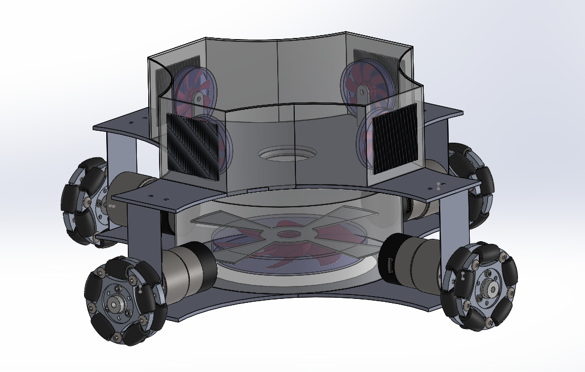
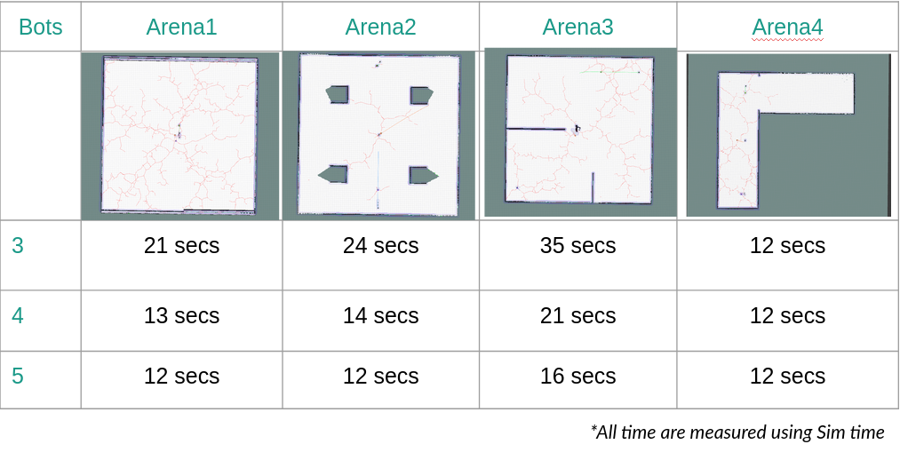
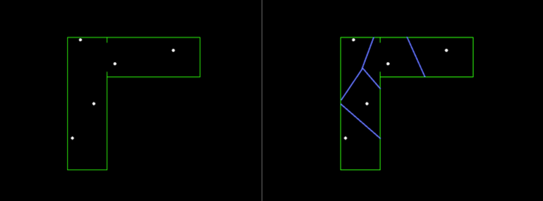
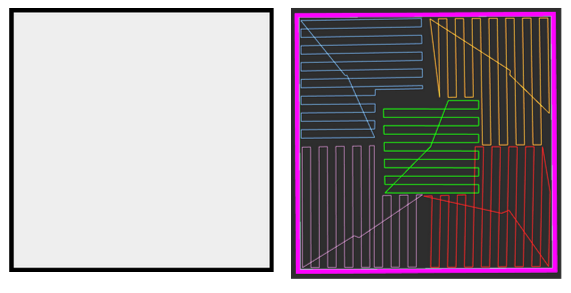
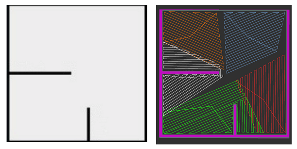
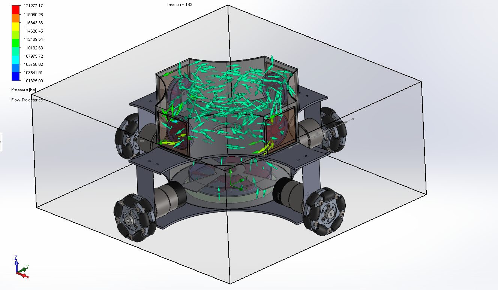
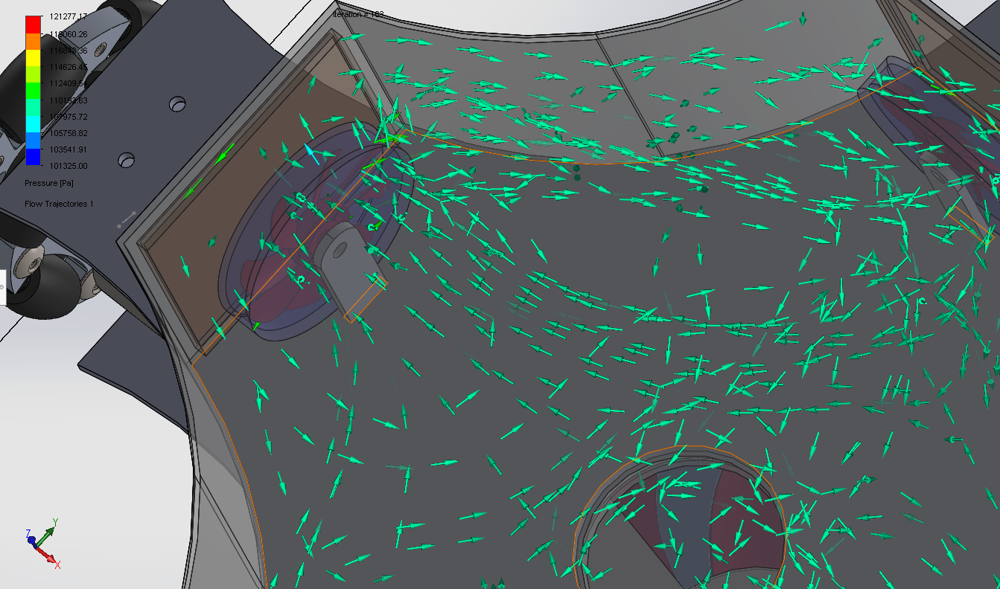

# Vox-Bot

```diff
- This repo contains only the base platform and the distibuted navigation stack and the mapping planner
```

ROS package for multi robot platform, Vox-Bot , its main purpose is cleaning and mapping in unknown terrains. A full description about VoxBot can be found here <a href="#desciption">Description</a>. This is our solution submitted for AIITRA robotics challenge 2021, where we secured second position among all other IIT s and prestigious colleges of India.

## Description

<p align="center">

<i>An CAD design of the the Vox-Bot</i>
</p>

Vox Bot is an 4 wheeled robot with omni wheels for maximum agility and mobility. The main purpose of the robot is to vacumm cleaner autonomously in unknown terrain.
It houses a lidar for mapping and a SBC for all computational needs, with one high power brushless motor for vacumm generation and 4 brushed motors for exhausts.

For the Vacumm system we have done multiple studies for the airflow which can be found here <a href="#airflowstudy">Airflow</a>.

Below we explain our solution for the Problem statement

## Pipeline

We have modified the Vanilla navigation stack offered in move base ROS. We have used movebase flex for implementing the below architecture of below navigation stack.

<p align="center">

<i>Complete Pipeline of our solution</i>
</p>

we have used [multirobot_map_merge](http://wiki.ros.org/multirobot_map_merge) with [rrt exploration](http://wiki.ros.org/rrt_exploration) for mapping the environment.

We have used [polygon_planner](https://github.com/ethz-asl/polygon_coverage_planning) for planning the boustrophedon path.

The rest is custom implemented with fortuners algorithm used for computing voronoi diagram. More detail can be found in our proposal [PDF](https://drive.google.com/file/d/1JusOGQFmkjaVjfD4kQLPCjKfHKlH5u1N/preview).

Below are a brief result that is not present in the proposal
### Mapping 
We have use RRT exploration instead of simple frontier exploration which made it very efficient

<p align="center">

<i>Comparision of number of bots and time to explore</i>
</p>

### Optimal coverage

we have used voronoi diagram and weighted centroid algorithm for distributing the task between individual robots, more detail about it can be found in the Proposal.

<p align="center">

<i>Generating voronoi diagram using Fortners algorithm</i>
</p>

### Boustrophoedn path

<p align="center">

</p>
<p align="center">
<i>Path distribution for arena 1</i>
</p>
<hr/>
<p align="center">
 
</p>
<p align="center">
<i>Path distribution for arean 2</i>
</p>

Generating boustrophoden path for the polygon given by the voronoi diagram the robot resides on.

## Airflow study

The vacuum of the bot works on the principle of the lower fan creating pressure difference to suck in air while the exhaust pushes out the air from the above compartment for efficient vacuum generation.  
The fan has been placed low for efficient cleaning, with a ground clearance measuring approximately less than half of the wheel radius.

Analysis of the vacuum mechanism was done using the SolidWorks Flow Simulation tool to get outputs about the kind of behavior shown by our vacuum during actual implementation.

The simulation required us to cover our rotating regions with circular bounded bodies to define the rotation boundary. We also defined the inlet and the outlet velocities as 0.6m/s and 0.15m/s below the bot and at the exhausts respectively. As the simulation was an internal one, the image only shows the flow inside our bot but the fact is quite evident through the trajectory of the arrows that in real-world scenarios, vox would certainly be an efficient vacuum design.

<p align="center">

<i>Hypothetical system of the Robot for full suction power</i>
</p>
<hr/>

The zoomed-in image of the flow clearly depicts that our exhausts are also working efficiently during closed space tests as the simulation required us to close the lower open space of our bot with a lid. The fans are generating the expected and the required flows quite efficiently.


<p align="center">

<i>Airflow inside the central chamber</i>
</p>

## Team
<table>
 <td align="center">
     <a href="https://github.com/hex-plex">
    <br /><sub><b>Somnath Sendhil Kumar </b></sub></a><br />
    </td>
<td align="center">
     <a href="https://github.com/GeneralVader">
    <br /><sub><b>Varad Vinayak pandey</b></sub></a><br />
	</td>
    <td align="center">
     <a href="https://github.com/Srini-Rohan">
    <br /><sub><b>Gujulla Leel Srini Rohan</b></sub></a><br />
	</td>
	<td align="center">
     <a href="https://github.com/jsparrow08">
    <br /><sub><b>Utkrisht Singh</b></sub></a><br />
	</td>
	<td align="center">
     <a href="https://github.com/phoenixrider12">
    <br /><sub><b>Aryaman Gupta</b></sub></a><br />
	</td>

</table>
